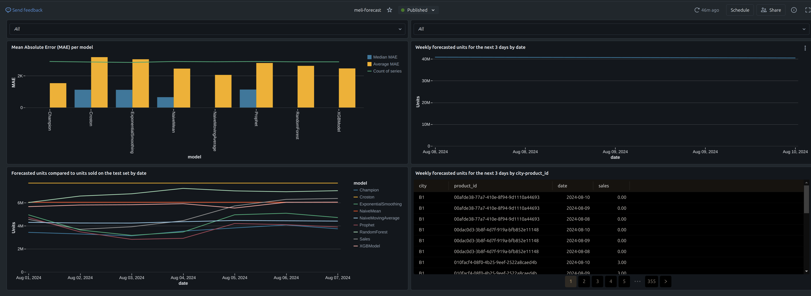
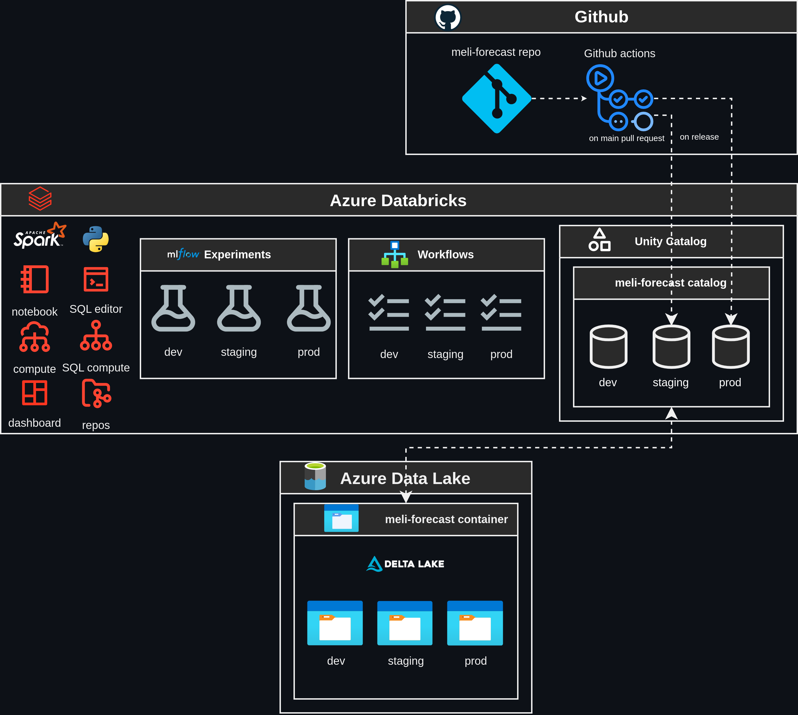
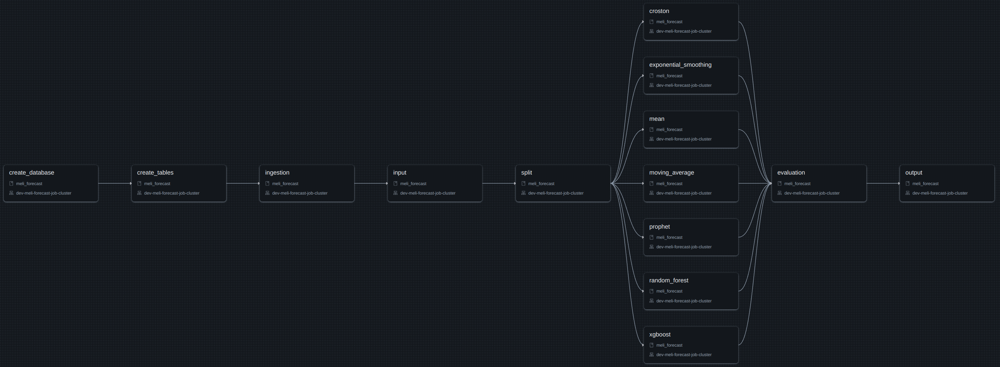
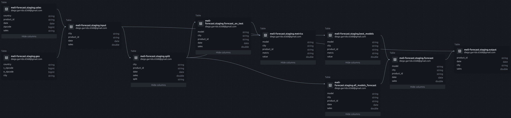
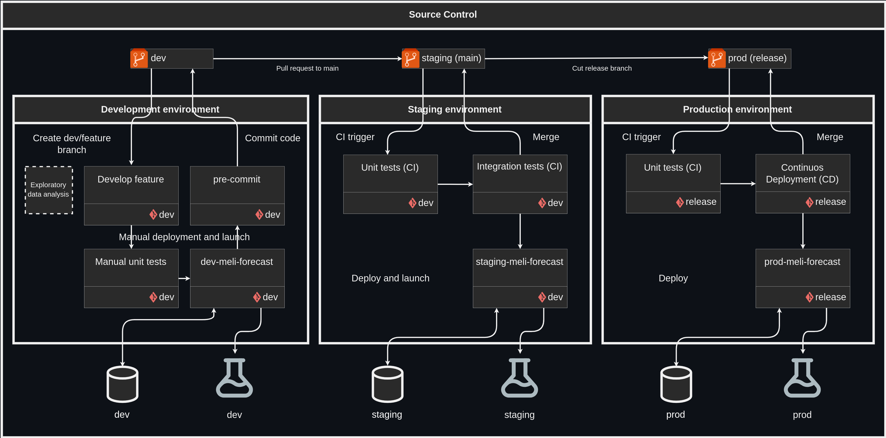

# meli-forecast

This repository aims to tackle a demand forecasting challenge for Mercado Libre (Meli). The goal is to predict the weekly demand for the next three days for each combination of `(city, product_id)`.

# Table of Contents

- [Exploratory Data Analysis](#exploratory-data-analysis)
- [Modelling](#modelling)
- [Forecasting results](#forecasting-results)
- [Settings](#settings)
    - [Local environment setup](#local-environment-setup)
    - [Running unit tests](#running-unit-tests)
    - [Databricks Setup](#databricks-setup)
    - [Running Jobs on Databricks](#running-jobs-on-databricks)
- [Arquitecture](#arquitecture)
- [Databricks Workflows](#databricks-workflows)
    - [Parameters](#parameters)
    - [Parameters overwritten](#parameters-overwritten)
    - [Tasks](#ingestion-workflow)
        - [create_database](#create_database)
        - [create_tables](#create_tables)
        - [ingestion](#ingestion)
        - [input](#input)
        - [split](#split)
        - [model](#model)
        - [evaluation](#evaluation)
        - [output](#output)
    - [Data lineage](#data-lineage)
- [Development methodology](#development-methodology)
    - [Development environment](#development-environment)
    - [Staging environment](#staging-environment)
    - [Production environment](#production-environment)

# Exploratory Data Analysis

The geo dataset includes two countries, Mexico and Brazil, with most cities being from Mexico. It has no missing values or duplicates and does not appear to have any data issues. The sales dataset spans from June 1, 2024, to August 7, 2024, covering 68 days with a total of 227,355 rows. It has 0.1% of rows with missing values in the sales column and 26.4% duplicate rows. There are 990 distinct products, and the sales data comes from five countries: Brazil, Mexico, Argentina, Chile, and Colombia, listed in descending order of transaction volume. The sales column is currently of type object instead of float due to the presence of the value "xfffx" in some rows. The high number of duplicates arises because each row represents a transaction, and the dataset has not been aggregated by (zipcode, product_id, date).

I am assuming that all sales are national; without this assumption, a single zipcode could correspond to multiple country-city pairs. Since the geo dataset includes zipcode ranges for cities in Brazil and Mexico, sales data from Argentina, Chile, and Colombia will be discarded. Consequently, any sales that do not intersect with the geo dataset will also be discarded. It is important to note that there are 7,920 possible city-product combinations, of which 2,951 are present in the sales data, representing approximately 37.26 percent.

I will consider all values that cannot be converted to a float as missing values, such as "xfffx," which appears in 0.12% of the rows and does not exhibit any discernible pattern. However, I will not eliminate higher values like 9999, as it seems the dataset was already truncated at this number or is the maximum value that the information system allows, which could explain why 17.52% of the rows contain this value. It is important to note that 0.02% of the rows have missing values. Additionally, the highest value of 9999 does not show a clear pattern when analyzed by weekday or city. This value is present in 25.49% of zip codes, 92.15% of products, and 70.99% of city-product combinations.

Aggregate sales by city, product, and date. Each combination of city and product is considered a time series. Null sales are treated as zero, indicating no sale occurred. Any missing dates between the first non-null sale and the last sale date in the dataset (2024-08-07) are filled with zeros for each time series.

To effectively categorize time series data, I will employ the Average Demand Interval (ADI) and the Coefficient of Variation squared (CV^2) following the Syntetos/Boylan classification method. This approach transforms a time series into one of four distinct categories: "smooth" "erratic" "intermittent" or "lumpy". Specifically, a time series is deemed "intermittent" if its ADI is greater than or equal to a threshold of 1.32, and "erratic" if its CV^2 is greater than or equal to a threshold of 0.49. If both conditions are met, the series is classified as "lumpy." Conversely, if neither condition is satisfied, the series is categorized as "smooth." This classification system provides a structured way to analyze and interpret time series data, facilitating more accurate forecasting.

In analyzing the distribution of time series categories, it is evident that the majority fall into the "lumpy" category, accounting for 63.50% of the data. This is followed by "intermittent" series, which make up 29.48%, indicating a significant portion of the data also exhibits sporadic demand patterns. "Erratic" series, with highly variable demand, represent 6.64% of the time series, while "smooth" series, characterized by consistent demand, constitute the smallest category at 0.37%, although half of it is smooth because dont have enough data. This distribution highlights the prevalence of irregular demand patterns in time series data, showing the importance of employing specialized forecasting methods to accurately predict future demand.

For more details, please refer to the `notebooks/eda.ipynb` notebook.

# Modelling

In forecasting, past data is used to make predictions about future trends in a time series. In this case, previous sales for a specific (`city`, `product_id`) can be used to predict sales for the following day.

To simplify, consider each pair of (city, product_id) independently. This means that we can train a forecasting algorithm simultaneously across multiple time series. For each time series, split it chronologically by date (to avoid data leakage issues) into a training and testing set. Then, train multiple forecasting algorithms on the training set and make predictions on the test set. Next, conduct a champion challenge to select the best model based on a specific metric computed on the test. Finally, use the best model to forecast the future.

By splitting the data into training and testing sets, we replicate real-world scenarios where the model is trained on historical data (training set) and tested on new, unseen data (testing set). This process provides a realistic evaluation of the model's predictive ability, helping to prevent overfitting and ensuring that the model can effectively generalize to new data. Ultimately, this approach leads to more reliable and accurate forecasts.

To perform forecasting, a diverse pool of models was chosen, including Exponential Smoothing, Prophet, XGBoost, Random Forest, Croston, Mean, and Moving Average. This is a prudent strategy for several reasons. Each model has its unique strengths and weaknesses, and leveraging a variety of approaches allows for a more comprehensive analysis. Exponential smoothing and Croston are particularly effective for handling time series data with trends and seasonality, as well as intermittent demand, respectively. Prophet is designed to handle time series data with strong seasonal effects and missing data points. Machine learning models like XGBoost and Random Forest can capture complex, non-linear relationships in the data, offering robust predictive power. Simpler models like Mean and Moving Average provide baseline forecasts that are easy to interpret and can serve as benchmarks for more complex models. By combining these models, we can mitigate the risk of relying on a single approach that may not perform well under all conditions.

The selected frequency for forecasting was daily because using any other type of aggregation would result in a misalignment of the forecast horizon. This involved predicting sales for the next 9 days and then aggregating it in moving windows of 7 days. A weekly aggregated time frame would predict sales for the next 3 weeks for the next 3 periods, while a weekly moving window would predict for the next period the demand for the next day and the previous 6 days (a week but with data leakage). However, a weekly moving window could potentially outperform daily frequency due to the series becoming smoother despite data leakage issues.

The Mean Absolute Error (MAE) is used to select the best model because of its interpretability, robustness to outliers, and simplicity. It represents the average absolute difference between predicted and actual values, making it easy to understand and communicate. Unlike Mean Squared Error (MSE), MAE is less sensitive to outliers and remains on the same scale as the data, providing a balanced view of model performance. Other metrics that are easier to interpret, such as Mean Absolute Percentage Error (MAPE) or Weighted Mean Absolute Percentage Error (WMAPE), were not chosen because most of the time series in the dataset are intermittent, which would make those metrics undefined due to zero division. However, it is important to note that other business metrics could be used that consider the cost of underestimating and overestimating the demand.

In cases where a time series cannot be forecasted due to insufficient training data, especially those with fewer than 3 data points, a dummy forecast is applied. This dummy forecast simply repeats the average sales. To avoid producing negative forecasts, the highest value between the actual forecast and zero is returned.

# Forecasting results

The champion model demonstrates a median MAE of 0.18 and an average MAE of 1.54k. In comparison, the moving average model has a median MAE of 0.29 and an average MAE of 2.06k. Despite these metrics, the champion model tends to underestimate sales volumes when aiming to minimize the MAE. This underestimation is primarily due to the prevalence of intermittent series. For the test week, the sales volume predicted by the champion model is 24.98M, while the moving average model predicts 30.4M. The actual sales volume, however, is 34.96M.

The importance of having a robust metric or evaluation methodology that considers the significance of sales volumes in demand forecasting cannot be overstated. Accurate volume predictions are crucial to avoid stockouts, which can severely impact service levels and customer satisfaction. A model that consistently underestimates demand may lead to insufficient inventory, resulting in lost sales and a negative customer experience. Therefore, it is essential to incorporate evaluation metrics that balance error minimization with the practical implications of inventory management and service level maintenance. This ensures that the forecasting model not only performs well statistically but also meets the operational needs of the business.



# Settings

This project performs distributed forecasting on Spark using [darts](https://github.com/unit8co/darts). The project uses Databricks Asset Bundles (dap) to deploy a demand forecasting pipeline as Databricks Workflow.

While using this project, you need Python 3.11 and `poetry` for package management.

## Local environment setup

1. Install poetry, a python packaging and dependency management.
```
curl -sSL https://install.python-poetry.org | python -
```

2. If you don't have JDK installed on your local machine, install it:
```
apt install openjdk-17-jdk
```

3. Install project locally (this will also install dev and test requirements):
```
poetry install --with dev,test
```

4. Alternatively, create a docker image with all dependecies:
```
docker build -t meli-forecast .
```

The commands in the following sections can be run with `poetry run <command>` or exactly as they are from inside a virtual environment activated with `poetry shell`.

## Running unit tests

For unit testing, please use `pytest`:
```
pytest tests/unit --cov
```

Alternatively, using docker
```
docker run --rm meli-forecast poetry run pytest tests/unit --cov
```

Please check the directory `tests/unit` for more details on how to use unit tests.
In the `tests/unit/conftest.py` you'll also find useful testing primitives, such as local Spark instance with Delta support, local MLflow and DBUtils fixture.

## Databricks Setup

- [Create an Azure Account](https://azure.microsoft.com)
- [Create an Azure Databricks Workspace](https://learn.microsoft.com/en-us/azure/databricks/getting-started)
- [Create Azure Data Lake Storage Gen 2](https://learn.microsoft.com/en-us/azure/storage/blobs/create-data-lake-storage-account)
- [Create Unity Catalog Metastore](https://learn.microsoft.com/en-us/azure/databricks/data-governance/unity-catalog/get-started)
- [Enable a workspace for Unity Catalog](https://learn.microsoft.com/en-us/azure/databricks/data-governance/unity-catalog/enable-workspaces)
- [Create a catalog with name `meli-forecast`](https://learn.microsoft.com/en-us/azure/databricks/data-governance/unity-catalog/create-catalogs)
- [Create Personal Access Token](https://learn.microsoft.com/en-us/azure/databricks/dev-tools/auth#--azure-databricks-personal-access-tokens-for-workspace-users)

## Running Jobs on Databricks

### Setting

Install the Databricks CLI from https://docs.databricks.com/dev-tools/cli/databricks-cli.html

Authenticate to your Databricks workspace:
```
databricks configure
```

### Deploy on a Job Compute

Deploy forecast from dev target.
```
databricks bundle deploy --target dev
```

(Note that "dev" is the default target, so the `--target` parameter
is optional here. If the workflow is not specified all are deployed)

You can find that job by opening your workpace and clicking on **Workflows**. Target with development mode are deployed with the prefix `[<target> ${workspace.current_user.userName}]` to avoid user collision.

Similarly, to deploy a production copy, type:
```
databricks bundle deploy --target prod
```

To run a job or pipeline, use the "run" comand:
```
databricks bundle run --target dev forecast
```

### Deploy on an interactive cluster

The workflows from a target with `mode: development` as the `dev` on this project can override the compute used in the deployment. To do this the following steps must be follows:

1. Create a cluster with the environment variables `MLFLOW_EXPERIMENT_NAME` and `WORKSPACE_FILE_PATH` as are set in the `databricks.yml` file. Navigate to the "Advanced options" section of your cluster setting, there you can set them in the "Environment variables" section.

2. Install the project python wheel in the cluster. To install a previously deployed wheel, navigate to the "Install library" section of your cluster settings, where you can explore the Workspace to locate and select the wheel's path, or you can upload a local generated wheel running the command `poetry build`, it will be created on the `dist/` directory.

3. Deploy the workflow to the cluster with the given compute ID.
```
databricks bundle deploy --compute-id <compute-id> -t dev
```

4. Similarly to other workflow, use the "run" command:
```
databricks bundle run -t dev forecast
```

### Working with notebooks and Repos

To start working with your notebooks from a Repos, do the following steps:

1. Add your git provider token to your user settings in Databricks

2. Add your repository to Repos. This could be done via UI, or via CLI command below:
```
databricks repos create --url <your repo URL> --provider <your-provider>
```
This command will create your personal repository under `/Repos/<username>/meli-forecast`.

3. Synchronize your local repository with a Databricks repo. With this any change on your local repository will be reflected in the Databricks repo.
```
databricks sync --profile <local-path> <remote-path> --watch
```

4. In `notebooks/sample_notebook.py` there is an example of how to launch the `split` task on a cluster. Note that the cluster must have all dependencies explained in the previous section.

# Arquitecture



## Forecast pipeline

The forecast workflow `<env>-forecast` reads and writes to the `meli-forecast` catalog from a Unity Catalog metastore. It uses the `data/[product_sales.csv, geo.csv]` datasets as input and writes them to a delta table. All outputs are written to the `meli-forecast` catalog, depending on the development environment it uses the `dev`, `staging`, or `prod` database.

## CI/CD pipeline

Continuos Integration (CI) and Continuos Deployment (CD) pipeline is orchestrated by Github Actions. In the first place, when a standard pull request is sent to the main branch the following steps are executed: checkout the repository, authenticate to Azure and retrieve Databricks secrets from an Azure Key Vault, set up `python`, install the package manager `poetry`, install dependencies, run unit tests, deploy and launch the `staging-meli-forecast` workflow to a Databricks workspace. In the second place, when a tag is pushed to the repository, the same steps as the previous pipeline are executed, with the exception that the `prod-meli-forecast` workflow is deployed and is not launched, because the production workflow is supposed to be scheduled.

# Databricks workflow

Workflows definition are in the `databricks.yml` file. It has the `<target>-meli-forecast` workflow, where `<target>` is the target or environment, with values in `[dev, staging, prod]`. The main difference between them is where they read and write. The following is the DAG (Directed Acyclic Graph) representation of the workflow.



## Parameters

Each task in the workflow uses a parameter file in `conf/<target>_config.yml`. This file path is used in the `python_wheel_task` section in the `databricks.yml` file, as value in `--conf-file /Workspace${workspace.root_path}/files/<relative_path>` parameter.

Common parameters to all tasks.
- `env`: String, it represent the environment, it can be `dev`, `staging` and `prod`.
- `tz`: String, time zone (optional), is used to compute the `execution_date` when it is not set. By default, it is set to 'America/Santiago'. This parameter is useful in order to avoid computing the wrong `execution_date` when the pipeline is executed between the boundary that separates two days.
- `execution_date`: String, execution date in format `"<yyyy>-<mm>-<dd>"`, it also works without quotes. If not specified the current date is used. If specified is recommended to set a Monday; otherwise, the last Monday from the current date will be used. Additionally, is used as date boundary, where `date <= execution_date - 1`.
- `database`: String, the database to read/write, it can be  `dev`, `staging` and `prod`.

Common parameters to some tasks.
- `group_columns`: List of string, used to identify a serie as unique.
- `time_column`: String, time column to use as serie time index.
- `target_column`: String, target column to use as serie value.

Ingestion task parametes.
- `dir`: String, relative directory where the CSV files are deployed.
- `sep`: String, column separator character.
- `cities`: List of string, optional. If specified, only these cities will be selected.

Split task parameters:
- `time_delta`: Integer, used to filter the data by a time window, with date betwen `[start_date, end_date]`, where `end_date = execution_date - 1` and `start_date = execution_date - time_delta`.
- `test_size`: Integer, number of past days since `execution_date - 1` that are used as part of the test set.
- `freq`: String, represents the frequency of the pandas DatetimeIndex, where the value `1D` means daily frequency.

Model task parameters:
- `model_cls`: String, must be the name of a model class present in `MODELS` (`darts.models` module), a reference to this can be found in the file `meli_forecast/model.py`. This is used as the `--model-name <model-name>` argument in the `python_wheel_task` related to forecasting.
- `model_params`: Dictionary, optional per forecast model, key-value pairs used to instantiate a forecasting model.
- `test_size`: Integer, number of days since the last date on train set to forecast.
- `steps`: Integer, number of days since the `execution_date` to forecast.
- `freq`: String, represents the frequency of the pandas DatetimeIndex, where the value `1D` means daily frequency.

Evaluation task parameters:
- `metrics`: List of string, list of metrics to compute. By the moment, those names should match the name of a function in the `darts.metrics` module.
- `model_selection_metric`: String, metric from `metrics` used to select the best model per serie, the critera is the one with minimum value.
- `freq`: String, represents the frequency of the pandas DatetimeIndex, where the value `1D` means daily frequency.

Output task parameters:
- `window_size`: Integer, number of days used to group the daily forecast.

## Parameters overwritten

To rerun a workflow with different parameters (such as changing the `execution_dt` parameter), you must update the configuration file, redeploy, and execute the workflow.

## Tasks

In this section we explain what does each task of the workflow.

### create_database

Create a database in the catalog `meli-forecast` with the name of the `database` parameter if it does not exist.

### create_tables

Create all workflow tables if they not exist.

### ingestion

Replace the data in the `sales` and `geo` tables with the information from the CSV files `data/product_sales.csv` and `data/geo.csv`, respectively. If the parameter `cities` is set it load only these cities.

### input

Retrieve the sales per (`city`, `production_id`, `date`) from the `sales` and `geo` tables. Sales with zip codes that do not belong to the zip code range in the `geo` table are discarded. Any sales values that cannot be converted to float are considered missing values and will be filled with zero. Finally, group the sales by (`city`, `production_id`, `date`) since each row in the `sales` table represents a transaction.

### split

The main purpose of this task is to divide the dataset into training and testing sets while maintaining the continuity of each time series. Null values are replaced with zeros between the first non-null value and the `execution_date - 1` periods. This table is created from the `sales` table and produces the `split` table with the same level of detail. Each series is identified by the `group_columns` parameter with the values `["city", "product_id"]`, which uniquely identify a series. The `time_column` parameter specifies the column to use as the time index, with the value `"date"`, and the `target_column` parameter specifies the column to use as the values of the series, with the value `"sales"`. The `test_size` parameter determines the rows that belong to the test set; the sales of the last `test_size` days are included in this set, with a value of 7 days.

### models

This task performs forecasting on the test set and into the future. All model tasks, such as `exponential_smoothing` with task paramenter `--model-name=ExponentialSmoothing`, overwrite the `model=<model-name>` partitions in the `forecast_on_test` and `all_models_forecast` tables. The `split` table is used as input for this task. Parameters like `group_columns`, `time_column`, and `target_column` are used to define a time series, consistent with the values in the `split` task. The `model_params` parameter contains model-specific hyperparameters as key-value pairs. The `test_size` parameter determines the number of periods to forecast after training on the training set. This forecast is stored in the `forecast_on_test` table. Similarly, the `steps` parameter specifies the number of periods to forecast after training on the full dataset, the value used is 9 days. This forecast is stored in the `all_models_forecast` table.

### evaluation

This task executes the champion challenge, selecting the optimal model for each series and generating the best forecast. It overwrites the delta tables `metrics`, `best_models`, and `forecast`. The input for this task comes from the `split`, `forecast_on_test`, and `all_models_forecast` tables.  Parameters such as `group_columns`, `time_column`, and `target_column` are used to define a time series, consistent with the values in the `split` and `model` tasks. The `metrics` parameter contains a list of metrics to be calculated from the `split` (where the split column equals test) and `forecast_on_test` input tables. The results are written to the `metrics` table, where the computed metrics include `["rmse", "mae"]` and must be present in the `darts.metrics` module. The `model_selection_metric` parameter is used to filter the `metric` table and select the best model per series, based on the minimum value criteria. The `mae` is used for this purpose, and the result is written to the `best_models` table. Finally, the `forecast` table is updated. This table is generated by the inner join between `all_models_forecast` and `best_models`, with the aim of retaining only the forecast of the best model per serie.

### output

This task generates the forecast that has been requested. It updates the `output` table by utilizing the data from the `input` and `forecast` tables. The daily forecast is combined into a weekly forecast for the next 3 days by using the `window_size` parameter, which is set to 7 days. In cases where time series cannot be forecasted due to insufficient training data, particularly those with fewer than 3 data points, a dummy forecast is applied. This dummy forecast simply repeats the average sales.

## Data lineage

Data lineage graph extracted from the Unity Catalog, specifically the `meli-forecast` catalog and the `prod` database.



# Development methodology

This section detailed the development methodology proposed and used.



## Development environment

The development environment is means to be used by developers to test their early stage developments, such as their feature branch which are in progress. To test their new feature, they can develop it in their favourite IDE. Create some unit test again to run their code. Then deploy the `dev-meli-forecast` on the Databricks workspace, following some of the three development loops mentioned in the [Setting chapter](#setting). When they are done, they can commit their code using the `pre-commit` check and following the [conventional commits](https://www.conventionalcommits.org/en/v1.0.0/) standard. Is recommended to apply `git rebase` or `git push -f feat/<feat-name>` in order to keep a clean branch before merging with the `main` branch.

## Staging environment

This environment is used to keep a clean main branch with code tested by unit and integration tests. When a pull request is created, where the target branch is the `main` branch a CI pipeline is triggered. The pull request will trigger the pipeline detailed in the `.github/workflows/onpush.yml` file. These steps are: checkout the branch from the repository, authenticate to Azure and retrieve Databricks secrets from an Azure Key Vault, install `python`,  install `poetry`, install dependencies using `poetry`, run `pre-commit` checks, run unit tests, and deploy and launch the `staging-meli-forecast` workflow in the Databrick workspace. Finnally, if all steps were successful and the reviewers approved the pull request, then the merged to the `main` brach is performed.

As a good practice is recommended to do a `pull --rebase origin main` before to send a pull request, this would update the feature branch with respect to the `main` branch. In this way, the CI pipeline will test a merged version instead of a pre-merged version, even if the later is successfull, the post-merged version might not be. Another reason to do this is to keep a linear history, which makes it easier for reviewers to focus only on new changes. A good article about the use of rebase can be found [here](https://www.atlassian.com/git/tutorials/merging-vs-rebasing#:~:text=Merging%20is%20a%20safe%20option,onto%20the%20tip%20of%20main%20.).

## Production environment

To cut a release the following steps must be followed. Upgrade package version in the `pyproject.toml` file, add a git tag with the same `<version-number>`, then push the commit to the main branch along with the tag. This will trigger the pipeline detailed in the `.github/workflows/onrelease.yml` file. These steps are: checkout the branch from the repository, authenticate to Azure and retrieve Databricks secrets from an Azure Key Vault, install `python`,  install `poetry`, install dependencies using `poetry`, run `pre-commit` checks, run unit tests, deploy the `prod-meli-forecast` workflow on the Databrick workspace, and publish the release. Note that this pipeline does not launch the workflow, because the production workflow is supposed to be scheduled.
